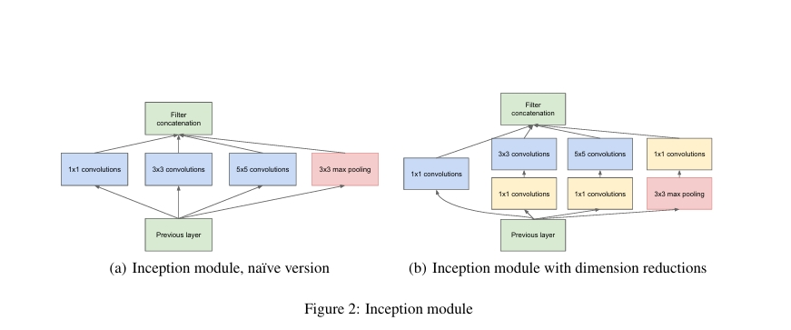

# Going Deeper with Convolutions (GoogLeNet/Inception)

## About

This paper introduces the Inception model and its most popular version GoogLeNet. The main goal of this model is to build deep and wide CNNs while keeping the computational cost reasonable.

---

## Why is this important?

Before this paper was introduced, most (CNNs) followed a simple and fixed design: a sequence of convolutional layers followed by fully connected layers with the concept: as these networks grew deeper, they also became slower, more memory-intensive and harder to train. 

The GoogLeNet model changed this traditional structure by introducing a new way to design CNNs. It applies multiple filter sizes (1×1, 3×3, and 5×5) within the same layer -> allowing the network to process information at different spatial scales in parallel -> One of its ideas was using 1×1 convolutionswhich helps in reducing dimensionality which helped decrease computational cost 

---

## Ideas Behind the Model

One of the smartest parts  I have found in GoogLeNet is Inception Modules. Instead of just using one filter size, they apply several ones (like 1×1, 3×3, and 5×5) all at the same time in the same layer. They even include a pooling operation too. Then, they take the results from all of them and put them together. This gives the network the ability to look at the image from different levels so it can notice small and big features.

Another great idea is the use of 1×1 convolutions. These may seem tiny, but they’re actually a huge deal! They help shrink the size of the data (reduce the number of channels) before running more complex operations. That means the network runs much faster and uses less memory. Plus, these 1×1 layers include activation functions like ReLU, which helps the network learn better.

To help with training such a deep network, the team added auxiliary classifiers — which are like mini networks attached to the middle of the model. These help keep the learning process stable and make sure the gradients (the values that update the weights) keep flowing all the way through the network. They also act like a form of regularization, helping the model avoid overfitting. Once training is done, these helpers are removed — they’re just used to support learning.

---

## What You Can Learn from This Paper

One cool idea in this paper is using different filter sizes at the same time small, medium, and large (1×1, 3×3, and 5×5) so the network can look at the image in more than one way. This helps it spot both tiny details and big patterns all in one go.

They also used something clever called 1×1 convolutions. It might sound small, but it plays a big role! It helps shrink the data size before doing heavy calculations, which makes everything run faster without losing useful information.

Another smart move was using several models together—this is called an "ensemble." Even though each model is trained separately, when their predictions are combined, the final result is often better than any single model on its own.

During training, they added extra little helper classifiers in the middle of the network. These aren’t used when making predictions later, but they help teach the model better and make training go more smoothly.

The big takeaway? You don’t need a huge network to get great results. If you build it the right way like GoogLeNet, you can make something deep and accurate without making it slow or using too much power. Smart design wins!

---

## Architecture (Google Net)

- Input size: 224×224 RGB image
- 22 trainable layers
- Inception modules stacked with occasional max-pooling
- Final layer: average pooling + dropout + fully connected + softmax

---
If you are interested, check the paper link [here](https://arxiv.org/pdf/1409.4842)